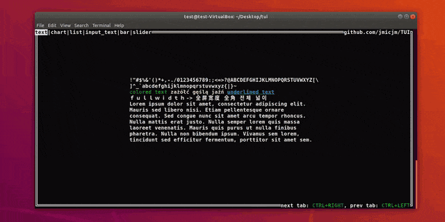

# Terminal user interface library


[source of this example](https://github.com/jmicjm/TUI/blob/master/examples/readme_example.cpp), stripped example(first tab only) below:
```c++
#include "tui.h"

int main()
{
	//box widget with {0x,0y} {100%x, 100%y} size
	tui::box main_box({ {0,0}, {100,100} });
	main_box.setTitle("github.com/jmicjm/TUI");
	main_box.setTitlePosition(tui::POSITION::END);

	//text widget with {0x,0y} {50%x, 50%y} size
	tui::text text({ {0,0}, {50,50} });
	//{0x,0y} {0%x,0%y} offset, origin{x,y} at center
	text.setPositionInfo({ {0,0}, {0,0}, {tui::POSITION::CENTER, tui::POSITION::CENTER} });
	tui::symbol_string str;
	for (char i = 33; i < 127; i++) { str.push_back(i); }
	str << tui::COLOR::GREEN << "\ncolored text " << tui::COLOR::YELLOW << u8"zażółć gęślą jaźń "
		<< tui::ATTRIBUTE::UNDERSCORE << tui::COLOR::CYAN << "underlined text";
	str += u8"\nｆｕｌｌｗｉｄｔｈ-> 全屏宽度 全角 전체 넓이";
	str += "\nLorem ipsum dolor sit amet, consectetur adipiscing elit. Mauris sed libero nisi. "
		"Etiam pellentesque ornare consequat. Sed congue nunc sit amet arcu tempor rhoncus. "
		"Nulla mattis erat justo. Nulla semper lorem quis massa laoreet venenatis. "
		"Mauris quis purus ut nulla finibus pharetra. Nulla non bibendum ipsum. "
		"Vivamus sem lorem, tincidunt sed efficitur fermentum, porttitor sit amet sem.";
	text.setText(str);
	//activated widget will handle user input, in full example activation/deactivation is handled by tui::navigation_group
	text.activate();

	tui::init();

	while (!tui::input::isKeyPressed(tui::input::KEY::ESC))
	{
		tui::output::clear();//clears buffer and resizes it to terminal size

		tui::output::draw(main_box);//copies widget to buffer
		tui::output::draw(text);

		tui::output::display();//displays buffer content
	}

	return 0;
}
```

## Features
* cross-platform(*NIX and Windows)
* easy positioning and sizing
* unicode support
  * utf-8
  * basic data type contains single grapheme cluster
  * fullwidth forms support
 * RGB color support
 
 ## Table of contents
 1. Basic data types 
    * rgb
    * color
    * symbol
    * symbol_string
    * surface
    * surface1D<horizontal/vertical>
2. Output
3. Input
4. Widgets
    * bar<horizontal/vertical>
    * box
    * button<horizontal/vertical>
    * chart
    * input_text
    * line<horizontal/vertical>
    * line_input
    * list
      * drop_list
    * radio_button<horizontal/vertical>
    * rectangle
    * scroll<horizontal/vertical>
    * slider<horizontal/vertical>
    * tabs<horizontal/vertical>
    * text
5. Compatibility
    * system
      * platform specific dependencies
    * terminal
6. Compiling
    
## 1. Basic data types

### rgb
Represents red, green and blue color channels
```c++
#include "tui_color.h"
tui::rgb rgb(r,g,b);
```
There are also 16 predefined constants inside tui::COLOR namespace

### color
Represents foreground and background colors
```c++
#include "tui_color.h"
tui::color color(rgb foreground, rgb background);
```

### symbol
Represents single [grapheme cluster](https://unicode.org/reports/tr29/#Grapheme_Cluster_Boundaries) + color + underline  
Its designed to avoid allocation for small clusters
```c++
#include "tui_symbol.h"
tui::symbol a = 'a';
tui::symbol b = U"\x1100\x1161\x11A8"; //"각" combined from three distinct code points: "ᄀ" + "ᅡ" + "ᆨ"
a.setColor(color c);
a.setUnderscore(bool);
```

### symbol_string
String of symbols
```c++
#include "tui_symbol_string.h"
tui::symbol_string str = "abcdefgh";
```

### surface
Represents 2D array of symbols. Its size and position are controlled by ```tui::surface_size``` and ```tui::surface_position```/```tui::anchor_position``` members
```c++
#include "tui_surface.h"

tui::surface surface; //creates surface with 1x1 size

surface.setSizeInfo(tui::surface_size({x,y}, {x%,y%})); // {x,y} + {x%,y%} size
//{x,y} offset + {x%,y%} offset , relative to relative_x/y_pos(eg {tui::POSITION::BEGIN, tui::POSITION::CENTER})
surface.setPositionInfo(tui::surface_position({x,y}, {x%,y%}, {relative_x_pos, relative_y_pos}));

surface[x][y] = 'a';// sets symbol at position {x,y}
surface.setSymbolAt('a', {x,y});//same as above
```
[examples](https://github.com/jmicjm/TUI/tree/master/examples/basic)

### surface1D<horizontal/vertical>
Acts as an overlay on top of surface. Its size is controlled by ```tui::surface1D_size```
```c++
#include "tui_surface.h"

tui::surface1D<tui::DIRECTION::HORIZONTAL> h_surface;
tui::surface1D<tui::DIRECTION::VERTICAL> v_surface;
```

## 2. Output
Remember to call ```tui::init()``` before using following functions
```c++
#include "tui_output.h" //or tui_io.h
//output loop
while(/**/)
{
tui::output::clear();
tui::output::draw(surface);
tui::output::display();
}
```

## 3. Input
```c++
#include "tui_input.h" //or tui_io.h
```
Remember to call ```tui::init()``` before using following functions
```c++
tui::input::getInput(); // returns std::vector<short> with pressed keys
```
```c++
tui::input::getStringInput(); // returns std::string with pressed keys(alphanumeric only)
```
```c++
tui::input::getRawInput(); // returns std::string with uninterpreted input, equivalent to calling getchar() in loop
```
```c++
tui::input::isKeyPressed(short key);
//for aplhanumeric use char value, for non-alphanumeric use enum from tui::input::KEY
```
```c++
tui::input::isKeySupported(short key); //return true if key is supported by terminal
```
```c++
tui::input::getKeyName(short key); // returns std::string with key name
```

## 4. Widgets

## 5. Compatibility
### system
Should work on most UNIX-like and Windows systems  
I personally tested it on few linux distributions, freeBSD and Windows10/7
##### platform specific dependencies
*NIX:  
```termios.h```  
```unistd.h ```  
```sys/ioctl.h```  
Windows:  
```windows.h```  
```conio.h```  
Platform dependent code is located in these files: ```src/tui_input.cpp```, ```src/tui_output.cpp```, ```src/tui_terminal_info.cpp```  
Checks for following defines : ```_WIN32```, ```__unix__```,```__linux__```

### terminal
*NIX:  
Retrieves key sequences and cursor related sequences from  ```infocmp``` output  
Checks ```$COLORTERM``` for ```"truecolor"```  
Windows:  
Uses predefined key sequences

In absence of RGB color automatically map colors to 4bit rgbi

## 6. Compiling
g++:  
```
g++ file.cpp path_to_src/*.cpp -Ipath_to_src -pthread -std=c++14
```
